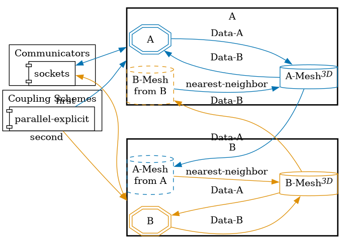


Get the [case files of this tutorial](https://github.com/precice/tutorials/tree/master/growing-mesh). Read how in the [tutorials introduction](https://precice.org/tutorials.html).


## Setup

## Configuration

preCICE configuration (image generated using the [precice-config-visualizer](https://precice.org/tooling-config-visualization.html)):



## Available solvers

There are two solvers that define the same mesh:

- A who runs first
- B who runs second

## Running the Simulation

Pass the amount of ranks to the run script of the solvers.
Not passing a number, runs the simulation on a single rank.
To run both on a two rank each, use:

```bash
cd A
./run.sh 2
```

and

```bash
cd B
./run.sh 2
```
